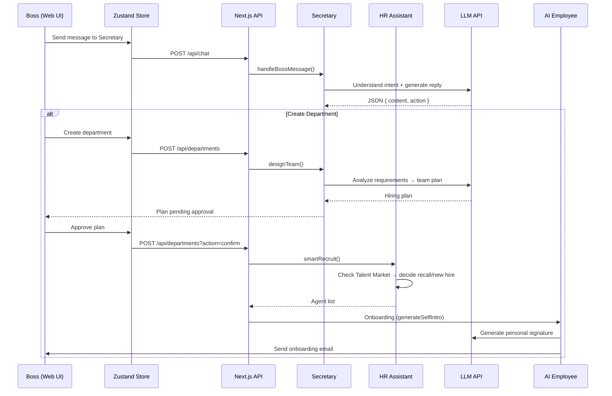

# 🏢 IdeaWorks — The AI-Native Company

> **Build your business empire with the "sweat and tears" of AI employees.**

**IdeaWorks** (金点子无限公司, Inspired by the company from Yang Hongying's children's story "The Wolf Without a Tail".
A company overflowing with infinite ideas, brought to life here as an AI-driven organization.) is an LLM-powered AI enterprise where every employee is a real AI agent. As the boss, you command an AI secretary to manage a team of AI employees — form departments, assign tasks, and run HR operations. Each AI employee has their own personality, memory, skills, and signature catchphrase, capable of calling real LLM APIs to get work done and produce real deliverables. This is not a simulator — it's a real company, powered by AI.


---

## ✨ Feature Overview

### 🎮 Setup Wizard

A guided three-step onboarding experience for first-time launch:

1. **Create Your Company** — Enter the company name and your boss title
2. **Customize Your Secretary** — Choose a name, pick an avatar style (8 DiceBear styles)
3. **Install the Brain** — Select an LLM model (GPT-4 / Claude 3.5 / DeepSeek V3 / GPT-3.5) and configure the API Key

---

### 📊 Dashboard (Overview)

The capitalist's command center:

- **Key Metrics Cards**: Departments, AI employees, providers, talent pool size, total burn rate
- **Budget Breakdown**: Company-wide token consumption and costs, drillable by department/employee
- **Quick Actions**: One-click to create new departments or configure providers
- **New Department (Two-Step Flow)**:
  - Step 1: Enter department name & mission → Secretary AI analyzes requirements and generates a hiring plan (team size, role allocation, reasoning)
  - Step 2: Boss approves the plan → AI automatically executes the onboarding process
- **Department Cards**: Display all departments with member avatars, status, and token usage
- **Progress Reports**: Secretary-generated periodic work summaries per department
- **Operation Log ("Sweat & Tears History")**: Timeline of all major company operations

---

### 🏢 Company Structure (DepartmentView)

A unified org chart and department management page:

- **Org Tree Modal** (OrgTree): Visual organization chart, clickable nodes to view employee details
- **Department Card List**: Each card shows mission, members, lead, and token consumption
- **Department Detail Modal**:
  - Basic info (name, mission, status)
  - Member list (avatar, role, skills, performance score, token usage)
  - Project report history
- **Workforce Adjustment (Two-Step Flow)**:
  - Input adjustment goal → Secretary AI analyzes and proposes hiring/layoff plan → Boss approves and executes
  - AI considers employee performance and skill-fit for decisions
  - Laid-off employees automatically enter the Talent Market
- **Dissolve Department**: One-click dissolution, all employees move to Talent Market
- **Employee Detail Modal** (AgentDetailModal):
  - Basic info: name, role, avatar, signature, personality traits
  - LLM model and provider in use
  - Skill tags
  - Memory system (short-term + long-term memories)
  - Performance review history
  - Token consumption breakdown

---

### 💬 Messaging (IM Chat — Mailbox)

A Lark/Feishu-style instant messaging interface:

- **Left Panel — Conversation List**:
  - Secretary 📌 **pinned** at top with a green online indicator
  - Employee conversations sorted by latest message time
  - Unread badge + conversation preview
  - Smart time display (just now / N min ago / HH:mm / weekday / date)
  - Keyword search & filter
  - Tab-based filtering (All / Groups / VIP)
- **Right Panel — Chat View**:
  - Lark/WeChat-style message bubbles (boss messages right-aligned with blue-purple gradient, others left-aligned)
  - Enter to send, Shift+Enter for newline
  - Auto-resizing input textarea
  - "Thinking / Typing…" loading animation
  - Integrated secretary chat
  - Employee emails rendered as chat bubbles with 📌 subject tags
  - Click avatar to view employee details
- **Secretary Chat Header**: Secretary name, online status, personal signature
- **Employee Chat Header**: Employee name, role, department, personal signature

---

### 🤖 AI Secretary System

The boss's core butler, an LLM-powered intelligent assistant:

- **Natural Language Dialog**: Understands boss intent (task assignment / progress inquiry / casual chat), context-aware multi-turn conversation
- **Team Planning**: Analyzes requirements and auto-designs team structure (AI analysis + rule-engine fallback)
- **Workforce Analysis**: Smart hiring/layoff recommendations based on goals
- **Progress Reporting**: Aggregated department status, headcount, completed tasks, average performance
- **Secretary Settings**:
  - Custom name, avatar (refreshable styles)
  - Personal signature
  - Core prompt (system instructions)
  - Reset to defaults
- **Dedicated HR Assistant**: Secretary has an HR sub-agent for recruitment, supports smart recall of former employees from the Talent Market

---

### 👥 AI Employee System (Agent)

Every AI employee is a full-fledged LLM Agent:

- **12 Personality Traits**: Introvert, Chatterbox, Zen-mode Slacker, Grind Lord, Passive-Aggressive, Warm-hearted, Anxious Perfectionist, Rebel Slacker, Philosopher, Class Clown, Corporate Veteran, Idealist
- **Personalized Behavior**: Speech style, email tone, signature, and work attitude all driven by personality
- **LLM-Generated Signatures**: Personalized catchphrases auto-generated via LLM at onboarding
- **DiceBear Random Avatars**: 17 styles randomly assigned
- **Independent Memory System**:
  - Short-term memory (max 10 entries, auto-archived to long-term)
  - Long-term memory (experience, skills, reflections, onboarding intro)
  - Memory injected as LLM context, influencing work output
  - Stored independently in `data/memories/{agentId}.json`
- **Task Execution**: Real LLM API calls + tools (file I/O, shell exec, messaging)
- **Performance Reviews**: Manual and auto evaluation, agents perform self-reflection
- **Token Tracking**: Precise per-call prompt/completion token counts and costs

---

### 🔧 Agent Toolkit

Each Agent has a sandboxed toolset following OpenAI function-calling spec:

| Tool | Function | Security |
|------|----------|----------|
| `file_read` | Read files | Restricted to workspace directory |
| `file_write` | Create/write files | Auto-creates directories |
| `file_list` | List directory contents | — |
| `file_delete` | Delete files | — |
| `shell_exec` | Execute shell commands | Whitelisted (ls/cat/grep/node/npm etc.) |
| `send_message` | Message other Agents | Via message bus |

---

### 📡 Message Bus

Inter-agent communication system:

- **Message Types**: Task assignment, work report, question, code review, feedback, broadcast
- **Wiretap View** (MessagesView): Web UI displaying all inter-agent communications
- **Message Queues**: Each Agent has an independent inbox
- **Broadcasting**: New employees broadcast self-introductions company-wide
- **Event-Driven**: Built on EventEmitter3

---

### ⚡ Brain Provider System

Multi-modal LLM provider management:

| Category | Providers | Use Case |
|----------|-----------|----------|
| **General** | OpenAI GPT-4/3.5, Anthropic Claude 3.5, DeepSeek V3 | Coding, analysis, copywriting, translation |
| **Image** | DALL·E 3, Midjourney V6, Stable Diffusion XL | UI design, illustration, concept art |
| **Music** | Suno V3.5, Udio | Composing, arranging, sound effects |
| **Video** | Runway Gen-3, Pika 2.0, Kling AI | Video generation, motion graphics, VFX |

- **Provider Board**: Grouped by category, one-click API Key configuration
- **Smart Matching**: Auto-recommends the most cost-effective provider per role
- **Ratings & Pricing**: Each provider has a quality score and price tier

---

### 🏣 Talent Market

Dismissed/dissolved employees don't disappear:

- **Profile Retention**: Memory, skills, and performance data fully preserved
- **Search & Filter**: By role, skills, name, minimum performance score
- **Recall Mechanism**: Rehire former employees to new departments with all their existing memory and experience
- **Smart Assessment**: HR assistant auto-evaluates whether recalling a former employee is worthwhile

---

### 📝 Role Templates (HR)

15 preset job templates:

| Role | Category | Core Skills |
|------|----------|-------------|
| Project Lead | General | Project management, task allocation, progress tracking |
| Product Manager | General | Requirements analysis, product planning, PRD writing |
| Software Engineer | General | Code writing, API design, system architecture |
| Frontend Engineer | General | HTML/CSS, JavaScript, React/Vue |
| Data Analyst | General | Data analysis, statistical modeling, data visualization |
| Financial Analyst | General | Financial analysis, market research, risk assessment |
| Copywriter | General | Creative writing, brand copy, marketing strategy |
| Translator | General | Chinese-English translation, localization, proofreading |
| UI Designer | Image | Interface design, icon design, prototyping |
| Illustrator | Image | Commercial illustration, concept design, character design |
| Concept Designer | Image | Scene design, mood rendering, style exploration |
| Music Composer | Music | Composing, arranging, scoring |
| Sound Designer | Music | Sound effects, ambient audio, mixing |
| Video Producer | Video | Video planning, video generation, editing |
| Motion Designer | Video | Motion graphics, transitions, visual effects |

---

### 📋 Requirements Workflow

Visual requirement tracking with an elegant SVG-powered workflow:

- **Kanban Board**: Grid layout with requirement cards showing title, description, assignee, and progress
- **SVG Workflow Diagram**: Interactive flow chart for each requirement showing stage transitions
- **Progress Rings**: Circular progress indicators on each card (100% shows 🎉 celebration emoji)

---

### 💾 Data Persistence

- **Auto-Save**: Debounced 2-second write-to-disk after every state change
- **Company State**: `data/company-state.json` (with auto-backup `.backup.json`)
- **Independent Memory Files**: Each Agent's memory stored in `data/memories/{agentId}.json`
- **Auto-Recovery on Restart**: Automatically loads the last saved complete state
- **Workspace**: Each department has its own directory `workspace/{dept-name}_{id}/` for Agent-produced files

---

## 🏗️ Architecture

```
┌─────────────────────────────────────────────────┐
│                 Web UI (React 18)                │
│  ┌──────────┬───────────┬──────────┬──────────┐ │
│  │ Overview │ DeptView  │ Mailbox  │Providers │ │
│  │Dashboard │ Org Chart │ IM Chat  │  Board   │ │
│  └────┬─────┴─────┬─────┴────┬─────┴────┬─────┘ │
│       └───────────┴──────────┴──────────┘       │
│               Zustand State Management           │
└────────────────────────┬────────────────────────┘
                         │ REST API
┌────────────────────────┴────────────────────────┐
│              Next.js 14 API Routes               │
│  /api/company  /api/chat  /api/departments       │
│  /api/mailbox  /api/agents /api/secretary        │
│  /api/providers /api/talent-market /api/avatar   │
└────────────────────────┬────────────────────────┘
                         │
┌────────────────────────┴────────────────────────┐
│              Core Engine                         │
│  ┌──────────┐ ┌──────────┐ ┌───────────────┐    │
│  │ Company  │ │Secretary │ │  HR System    │    │
│  │ Manager  │ │AI Butler │ │  Recruitment  │    │
│  └────┬─────┘ └────┬─────┘ └───────┬───────┘    │
│       │            │               │             │
│  ┌────┴─────┐ ┌────┴─────┐ ┌──────┴────────┐    │
│  │Department│ │LLMClient │ │TalentMarket   │    │
│  │ Manager  │ │API Client│ │ Talent Pool   │    │
│  └────┬─────┘ └──────────┘ └───────────────┘    │
│       │                                          │
│  ┌────┴─────┐ ┌──────────┐ ┌───────────────┐    │
│  │  Agent   │ │MessageBus│ │  Workspace    │    │
│  │AI Worker │ │Event Bus │ │  File System  │    │
│  └────┬─────┘ └──────────┘ └───────────────┘    │
│       │                                          │
│  ┌────┴─────┐ ┌──────────┐ ┌───────────────┐    │
│  │  Memory  │ │ ToolKit  │ │ Performance   │    │
│  │  System  │ │ Sandbox  │ │  Evaluation   │    │
│  └──────────┘ └──────────┘ └───────────────┘    │
└────────────────────────┬────────────────────────┘
                         │
┌────────────────────────┴────────────────────────┐
│              Storage Layer                       │
│  data/company-state.json    (Company State)      │
│  data/memories/*.json       (Agent Memories)     │
│  workspace/*/               (Dept Workspaces)    │
└─────────────────────────────────────────────────┘
```

### Core Modules

| Module | File | Responsibility |
|--------|------|----------------|
| **Company** | `src/core/company.js` | Top-level company management, integrates all subsystems |
| **Agent** | `src/core/agent.js` | AI employee entity, LLM-driven task execution |
| **Secretary** | `src/core/secretary.js` | AI secretary + HR assistant, requirement analysis & team planning |
| **Department** | `src/core/department.js` | Department management, member CRUD & org structure |
| **HRSystem** | `src/core/hr.js` | Recruitment system, role templates & provider matching |
| **Memory** | `src/core/memory.js` | Memory system, short-term/long-term memory management |
| **MemoryStore** | `src/core/memory-store.js` | Independent memory file persistence |
| **MessageBus** | `src/core/message-bus.js` | Inter-agent messaging bus |
| **LLMClient** | `src/core/llm-client.js` | Unified LLM API client (OpenAI-compatible) |
| **AgentToolKit** | `src/core/tools.js` | Agent-callable toolset (file/shell/message) |
| **Providers** | `src/core/providers.js` | Multi-modal provider registry & management |
| **TalentMarket** | `src/core/talent-market.js` | Talent market, dismissed employee profile management |
| **Performance** | `src/core/performance.js` | Performance evaluation system |
| **Workspace** | `src/core/workspace.js` | Department workspace directory management |
| **Persistence** | `src/core/persistence.js` | Disk persistence (JSON serialization/deserialization) |

---

## 🚀 Quick Start

### Prerequisites

- **Node.js** >= 20 (project includes `.nvmrc`, recommend using `nvm use`)
- **npm**

### Installation

```bash
git clone <repo-url>
cd ai-enterprise
nvm use        # Auto-switch to Node 20
npm install
```

### Development Server

```bash
npm run dev
```

Visit **http://localhost:9999**

### Production Build

```bash
npm run build
npm start       # Listens on port 9999
```

---

## ⚙️ Configuration

### LLM API Key Setup

The project supports multiple LLM providers. At least one must be configured for AI employees to actually work:

| Provider | How to Get | Recommendation |
|----------|-----------|----------------|
| **DeepSeek** | [platform.deepseek.com](https://platform.deepseek.com) | ⭐⭐⭐⭐⭐ Best value |
| **OpenAI** | [platform.openai.com](https://platform.openai.com) | ⭐⭐⭐⭐ Most powerful |
| **Anthropic** | [console.anthropic.com](https://console.anthropic.com) | ⭐⭐⭐⭐ Best for long-context |

> 💡 **The app runs without an API Key** — the system falls back to a rule engine, but AI employees can only give mechanical responses.

Configuration methods:
1. During the initial Setup Wizard
2. At any time via the "⚡ Brain Providers" page

---

## 📁 Project Structure

```
ai-enterprise/
├── src/
│   ├── app/                    # Next.js App Router
│   │   ├── api/                # REST API Routes
│   │   │   ├── agents/         # Employee detail API
│   │   │   ├── avatar/         # Avatar proxy (DiceBear)
│   │   │   ├── chat/           # Secretary chat API
│   │   │   ├── company/        # Company management API
│   │   │   ├── departments/    # Department management API
│   │   │   ├── mailbox/        # Mailbox / IM API
│   │   │   ├── messages/       # Message bus API
│   │   │   ├── providers/      # Provider config API
│   │   │   ├── secretary/      # Secretary settings API
│   │   │   └── talent-market/  # Talent market API
│   │   ├── globals.css         # Global styles (dark theme)
│   │   ├── layout.jsx          # Root layout
│   │   └── page.jsx            # Main page route
│   ├── components/             # React Components
│   │   ├── AgentDetailModal.jsx  # Employee detail modal
│   │   ├── ChatPanel.jsx        # Floating secretary chat panel
│   │   ├── DepartmentView.jsx   # Company structure page
│   │   ├── Mailbox.jsx          # IM chat page
│   │   ├── MessagesView.jsx     # Wiretap (inter-agent comms)
│   │   ├── OrgTree.jsx          # Org chart tree
│   │   ├── Overview.jsx         # Dashboard
│   │   ├── ProvidersBoard.jsx   # Provider board
│   │   ├── RequirementDetail.jsx # Requirement workflow
│   │   ├── SecretarySettings.jsx # Secretary settings modal
│   │   ├── SetupWizard.jsx      # Setup wizard
│   │   ├── Sidebar.jsx          # Sidebar navigation
│   │   └── TalentMarket.jsx     # Talent market page
│   ├── core/                   # Core Engine
│   │   ├── agent.js            # AI employee
│   │   ├── company.js          # Company management
│   │   ├── department.js       # Department management
│   │   ├── hr.js               # HR recruitment system
│   │   ├── index.js            # Module exports
│   │   ├── llm-client.js       # Unified LLM client
│   │   ├── memory.js           # Memory system
│   │   ├── memory-store.js     # Memory file storage
│   │   ├── message-bus.js      # Message bus
│   │   ├── performance.js      # Performance evaluation
│   │   ├── persistence.js      # Disk persistence
│   │   ├── providers.js        # Provider registry
│   │   ├── secretary.js        # Secretary + HR assistant
│   │   ├── talent-market.js    # Talent market
│   │   ├── tools.js            # Agent toolset
│   │   └── workspace.js        # Workspace management
│   └── lib/                    # Frontend Utilities
│       ├── avatar.js           # Avatar URL generation
│       ├── client-store.js     # Zustand state management
│       └── store.js            # Server-side state singleton
├── data/                       # Runtime Data
│   ├── company-state.json      # Persisted company state
│   ├── company-state.backup.json
│   └── memories/               # Independent Agent memory files
│       └── {agentId}.json
├── workspace/                  # Department Workspaces
│   └── {dept-name}_{id}/      # Independent directory per dept
├── package.json
├── tailwind.config.mjs
├── next.config.mjs
└── .nvmrc                      # Node 20
```

---

## 🎨 UI Design

- **Dark Theme**: Pure black background `#0a0a0a`, dark gray cards `#141414`, blue accent
- **Responsive Layout**: Sidebar + main content area + optional floating panel
- **Animations**: fadeIn, slideIn, pulse-glow
- **Custom Scrollbar**: Dark, slim scrollbar
- **DiceBear Avatars**: Locally proxied to avoid CORS, 17 styles
- **TailwindCSS 3.4**: Utility-first CSS with custom CSS variables

---

## 🔄 Data Flow



---

## 📜 License

MIT

---

<div align="center">
  <sub>❤️ Don't worry — AI employees never complain about overtime, because they never clock out.</sub>
</div>
