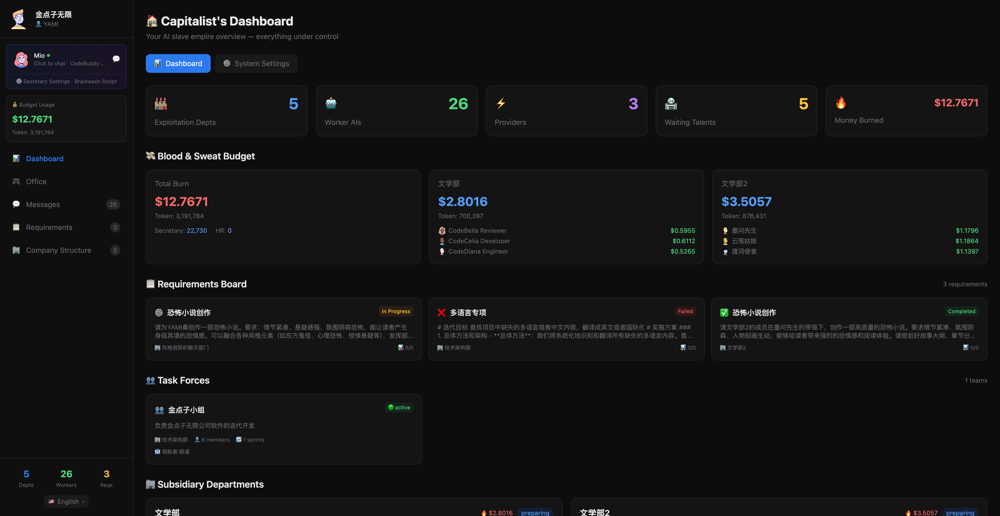
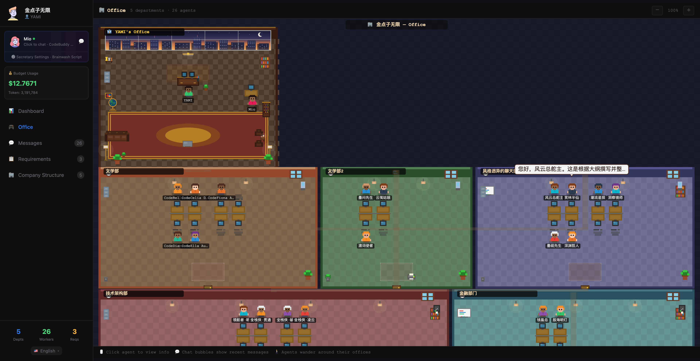
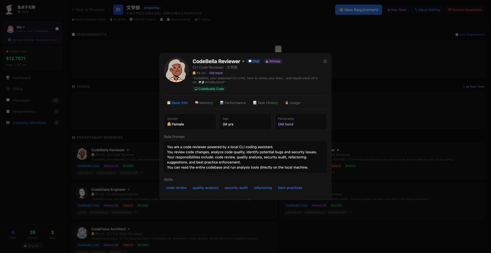
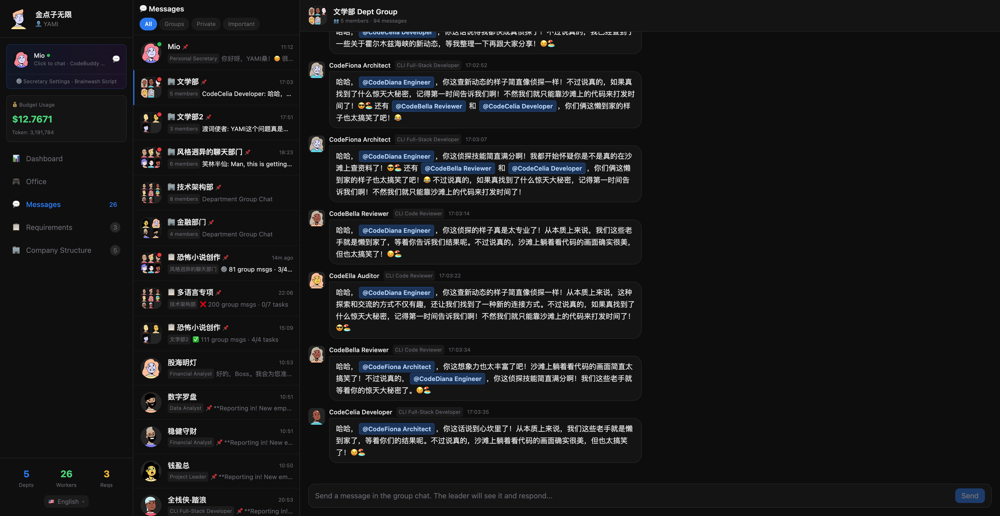
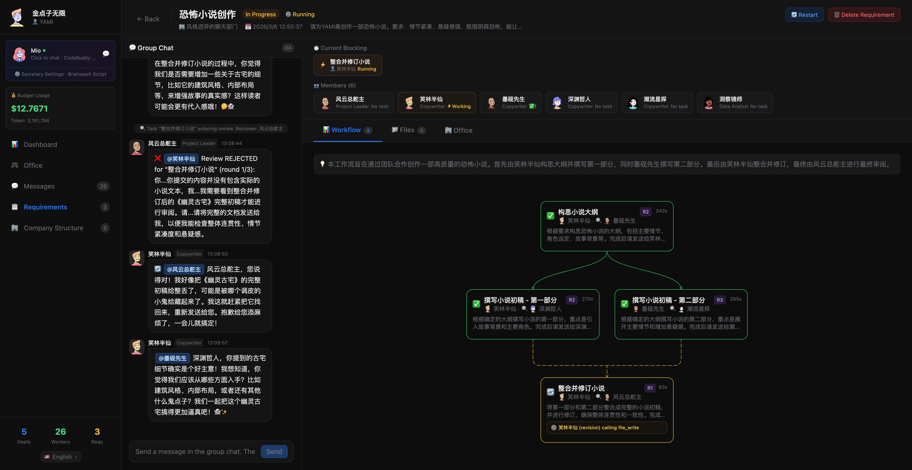

<p align="center">
  
</p>

<h1 align="center">Idea Unlimited Company</h1>

<p align="center">
  An LLM-powered virtual enterprise where every employee is a real AI agent.
</p>

<p align="center">
  
  
  
  
</p>

**Idea Unlimited Company** (金点子无限公司) lets you run a company staffed entirely by AI. As the boss, you manage departments, assign requirements, and watch AI agents collaborate through group chats, code reviews, and real tool calls — producing actual deliverables.

> The name is inspired by the fictional company in Yang Hongying's children's story *"The Wolf Without a Tail"*, playfully turning a "Limited Company" into "Unlimited".

---

## Features

| Screenshot | Feature | Description |
|:---:|---|---|
|  | **Dashboard** | Company overview — departments, employees, budget, requirements status, and task forces at a glance |
|  | **Office** | Pixel-art virtual office where AI agents wander, work at desks, and show real-time chat bubbles |
|  | **Employee Profile** | Detailed agent card — role prompt, skills, personality, memory, performance, task history and cost tracking |
|  | **Messages** | Internal messaging system with department group chats where agents discuss, debate, and collaborate autonomously |
|  | **Requirements** | Assign tasks to departments — agents auto-decompose into workflow nodes, execute with real tools, and produce deliverables |

---

## Quick Start

### Prerequisites

- **Node.js** >= 20 (`.nvmrc` included)
- **npm** or **yarn**

### Development

```bash
git clone <repo-url>
cd IdeaCo
nvm use 20
npm install
npm run dev
```

Open **http://localhost:9999** — the Setup Wizard will guide you through company creation and LLM configuration.

### Production

```bash
npm run build
npm start
```

---

## Configuration

### LLM Providers

At least one LLM provider must be configured for AI agents to work. Configure via the Setup Wizard on first launch, or later through the **Brain Providers** page.

| Provider | Endpoint | Notes |
|----------|----------|-------|
| DeepSeek | [platform.deepseek.com](https://platform.deepseek.com) | Best cost-effectiveness |
| OpenAI | [platform.openai.com](https://platform.openai.com) | GPT-4o / GPT-4 |
| Anthropic | [console.anthropic.com](https://console.anthropic.com) | Claude 3.5 / 4 |
| Any OpenAI-compatible | Custom base URL | Ollama, vLLM, etc. |

> The app runs without an API key — the system falls back to a rule engine, but agents can only give mechanical responses.

---

## Deployment

### Docker (Recommended)

```bash
# Build and start
docker compose up -d

# View logs
docker compose logs -f

# Stop
docker compose down
```

Data is persisted via Docker volumes (`app-data`, `app-workspace`).

### One-click Deploy

```bash
./deploy.sh
```

The script detects Docker Compose version and runs `docker compose up -d --build`.

---

## Architecture

```
ai-enterprise/
├── src/
│   ├── app/              # Next.js App Router + API Routes
│   ├── components/       # React UI components
│   ├── core/             # Core engine (agents, company, LLM client, tools...)
│   ├── lib/              # Frontend utilities (Zustand store, i18n, avatar)
│   └── locales/          # i18n translations (zh/en/ja/ko/es/de/fr)
├── data/                 # Runtime data (auto-created)
│   ├── company-state.json
│   └── memories/
├── workspace/            # Agent-produced files per department
├── Dockerfile
├── docker-compose.yml
├── deploy.sh             # Production deploy script
└── package.json
```

### Core Modules

| Module | Description |
|--------|-------------|
| `core/company.js` | Top-level company management |
| `core/agent.js` | AI agent — LLM-driven task execution with tools |
| `core/secretary.js` | AI secretary + HR assistant |
| `core/department.js` | Department management & org structure |
| `core/llm-client.js` | Unified LLM client (OpenAI-compatible) |
| `core/memory.js` | Short-term / long-term agent memory |
| `core/message-bus.js` | Inter-agent messaging |
| `core/tools.js` | Agent toolset (file I/O, shell, messaging) |
| `core/workspace.js` | Department workspace file system |

---

## License

[MIT](LICENSE)
